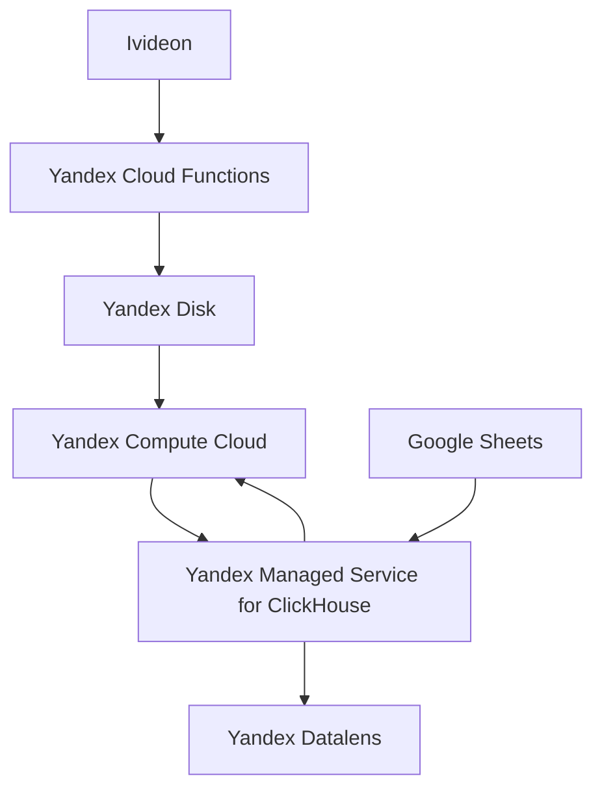

# ML System Design Document

## Зачем идем в разработку продукта? 
**Цель**: Создать систему для объективной оценки эффективности продавцов розничных магазинов на основе видеоанализа.  
**Основные задачи**:
- Увеличить продажи и мотивацию сотрудников через объективную оценку.
- Сократить время, затрачиваемое менеджерами на ручной анализ.
- Предоставить данные для улучшения расположения магазинов и оптимизации рабочего процесса.

---

## Бизнес-требования и ограничения
### Требования:
1. **Понятный интерфейс для менеджеров**:
   - Визуализация данных в виде дашбордов.
2. **Реализация ключевых метрик**:
   - Соотношение взаимодействий.
   - Средняя стоимость покупки с/без консультации.
   - Количество успешных и неуспешных взаимодействий.

### Ограничения:
1. **Скорость работы**:
   - Обработка видео за день не более 2 часов.
2. **Объем данных**:
   - Хранение данных в течение 3 дней.
3. **Бюджет**:
   - Использование готовых моделей (YOLOv8, StrongSORT) и облачных сервисов (Yandex Cloud).

---

## Скоуп проекта/итерации
### Входит в текущую итерацию:
1. Детекция и трекинг объектов на видео.
2. Расчет ключевых метрик производительности продавцов.
3. Визуализация результатов через Yandex Datalens.

### Не входит:
1. Анализ эмоционального состояния клиентов.
2. Полноценная интеграция с CRM.

---

## Предпосылки решения
1. **Проблема субъективности в оценке продавцов**:
   - Традиционные методы (опросы, наблюдения) ненадежны и подвержены человеческому фактору.
2. **Рост доступности технологий компьютерного зрения**:
   - Использование готовых моделей YOLO и трекинга (StrongSORT).
3. **Необходимость масштабируемого решения**:
   - Облачные сервисы для хранения и обработки больших объемов данных.

---

## Постановка задачи
Разработать систему, которая:
1. Автоматически извлекает данные из видео с помощью моделей детекции и трекинга.
2. Рассчитывает и визуализирует ключевые бизнес-метрики.
3. Интегрируется с текущими системами данных и предоставляет отчеты для менеджеров.

---

## Блок-схема решения

P.S. Google Sheets - это не хранилище данных, а таблицы где расписано в какие смены работает какой продавец

## Этапы решения задачи
### Этап 1. Подготовка данных
#### Описание данных/сущностей:
- Основные данные поступают из видеофайлов формата MP4, получаемых с камер видеонаблюдения.
- Метаданные включают разрешение видео, количество кадров, частоту кадров, длительность видео.
- Основные проблемы с качеством данных:
  - Низкое качество записи в некоторых видео (размытость, плохое освещение).
  - Плохое расположение камеры (например, слишком высоко или слишком низко).
  - Неполные данные о взаимодействиях (например, отсутствие временных меток начала/окончания). 
#### Риски и проблемы на этапе EDA:  
- Возможная несбалансированность данных (например, из-за различного расположения камер разный обьем людей попадающих в кадр).
- Наличие кадров без объектов (пустые сцены).
- Камеры часто отключаются и включаются.  
- Наличие камер смотрящих в пустоту.
#### Описание процесса генерации данных:  
- Видео загружаются через API системы видеонаблюдения (например, Ivideon).
- Данные извлекаются в виде кадров с заданной частотой (например, 1 кадр в секунду).
- Данные сохраняются в Yandex Disk.
- Процесс регулярный, с автоматической выгрузкой новых данных каждые 24 часа.
- Далее неаннотированные данные поступают на вход трекингу.
#### Обработка конфиденциальной информации:
- Обработка данных исключительно на защищенных серверах.
#### Необходимый результат этапа:
- Готовый размеченный датасет с метаданными, пригодный для инференса моделей.
#### Дополнительная информация:
- Инструменты разметки должны быть протестированы на удобство и скорость работы.
---
### Этап 2. Подготовка прогнозных моделей
**Описание ML-метрик и функций потерь:**  
#### ML-метрики:
  - mAP (Mean Average Precision) для оценки точности детекции объектов.
  - HOTA (Higher Order Tracking Accuracy) для оценки качества трекинга.
  - MOTA (Multiple Object Tracking Accuracy) для общей оценки работы модели.  
#### Функции потерь:
  - Cross-Entropy Loss для классификации объектов.
  - IoU Loss для локализации объектов.
#### Схема ML-валидации:
- Тестирование на размеченных в Yandex Toloka данных.
#### Структура бейзлайна:
- Использование YOLOv8 для детекции объектов.
- Трекинг объектов с помощью StrongSORT или DeepSORT.
- Предобработка данных: ресайзинг кадров, нормализация значений пикселей.  
#### Стратегии дальнейшего развития:
- Подбор гиперпараметров (learning rate, batch size).
- Тестирование дополнительных моделей (например, YOLO-NAS).
- Улучшение аугментации данных (повороты, изменение освещения).
- Feature Engineering: добавление новых признаков (например, расстояние между объектами).  
#### Анализ и интерпретация работы модели:
- Построение confusion matrix для оценки ошибок классификации.
- Визуализация траекторий объектов для проверки трекинга.
- Анализ false positives/negatives для улучшения модели.  
#### Риски и способы их снижения:
- Риск переобучения: использование регуляризации (dropout, weight decay).
- Риск недооценки редких классов: балансировка классов в данных.    
#### Необходимый результат этапа: 
- Обученная и валидированная модель, готовая к тестированию в продакшене.  
#### Дополнительная информация:
- Используемые фреймворки: PyTorch, TensorFlow.
- Рекомендуется автоматизация процесса обучения через MLflow или аналогичные инструменты.
---
### Этап 3. Специфические этапы для задачи
#### Этап 3.1. Нахождение продавца среди покупателей:
- Baseline:
   - Продавец - это человек, который находится в кадре дольше всех остальных людей.
- Улучшение:
   - Использование моделей глубокого обучения для распознавания продавцов.
#### Этап 3.2. Интеграция модели в систему:
- Настройка API для получения видео и отправки результатов детекции.
- Реализация дашборда для визуализации аналитики (например, Yandex Datalens).  
#### Этап 3.3. Мониторинг и поддержка:
- Настройка системы мониторинга качества модели (drift detection).
- Регулярное обновление данных и дообучение модели.
